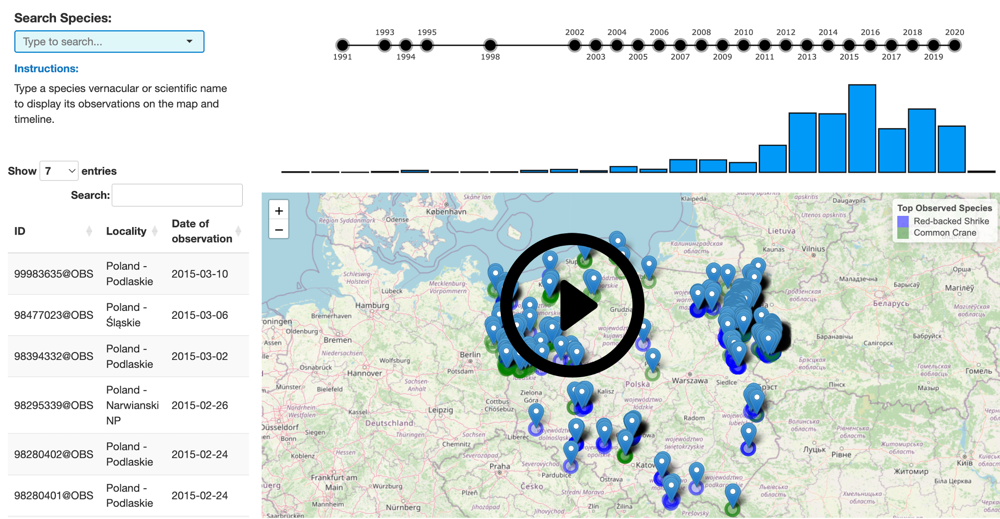

# Biodiversity App

## Overview

The **Biodiversity App** is a Shiny-based web application designed to explore and analyze biodiversity data in Poland. This app allows users to visualize, interact with, and analyze biodiversity-related datasets using various data visualization techniques such as interactive maps, plots, and graphs.

The app leverages the power of **Shiny** for interactivity, **Leaflet** for mapping, **ggplot2** and **plotly** for advanced visualizations, and other R libraries for data processing and manipulation.

[](https://www.youtube.com/watch?v=hd-cIeGl7kk&ab_channel=MartaBica)

<a href="https://www.youtube.com/watch?v=YOUR_VIDEO_ID" target="_blank">
  
</a>


## Features

- **Data Visualization**: Interactive visualizations of biodiversity data, including maps and charts.
- **Geospatial Analysis**: Visualize biodiversity data on maps using **Leaflet**.
- **Interactive Plots**: Use **plotly** for interactive graphs and **ggplot2** for high-quality static plots.
- **User-Friendly Interface**: A Shiny app interface that allows users to easily interact with the data and explore different visualizations.

## Modules

The app consists of several interactive modules, each serving a specific function:

### 1. **Species Search**
This module allows users to search for species in the biodiversity dataset. It provides a user interface to query species by vernacular or scientific name and displays relevant results.

### 2. **Timeline**
The Timeline module visualizes the year timepoints of species observations. Users can select a specific year by clicking on it, and the app will filter the dataset to display only the data points corresponding to the selected year, thereby increasing resolution.

### 3. **Histogram**
This module generates a histogram to visualize the distribution of observation events across years. It complements the timeline by providing a quick overview of the years with the highest and lowest number of observations, without cluttering the timeline with individual event dates.

### 4. **Observation Table**
The Observation Table module displays a table of species observations. This table can be filtered or sorted, allowing users to view specific data points and gain insights into different species' occurrences. Additionally, users can click on entries to open a webpage with more detailed information about the observation, including a photograph of the specimen, where available.

### 5. **Map**
The Map module uses **Leaflet** to visualize the geographical distribution of species observations. It shows interactive maps where users can explore how species are distributed across different regions in Poland.

# Deploying the App in a Browser

You can access the **Biodiversity App** directly from your browser using the following link:

[Visit the Biodiversity App](https://martabica.shinyapps.io/biodiversity-app/)

This app is hosted on **shinyapps.io**.

# Deploying the App locally

## Installation

To run the app locally, follow these steps:

### Prerequisites

Make sure you have the following installed:

- **R** (latest version recommended)
- **Shiny** library
- Other R libraries as listed in the `DESCRIPTION` file

### Steps

1. Clone the repository:

   ```bash
   git clone https://github.com/martabica/biodiversity-app.git
   cd biodiversity-app
   ```

2. Install the required R libraries:

   You can use the `install.packages()` function to install the necessary dependencies. Alternatively, use the `DESCRIPTION` file to install all the packages in one go.

   ```r
   install.packages(c("shiny", "shinyjs", "leaflet", "dplyr", "ggplot2", "plotly", "data.table", "waiter"))
   ```

3. Run the app:

   In your R console, run the following command:

   ```r
   shiny::runApp("app.R")
   ```

   This will launch the app in your default web browser.

## Running the App with Docker

To run the app in a Docker container, follow these steps:

1. Ensure you have Docker installed on your machine. If not, you can download and install Docker from [here](https://www.docker.com/get-started).

2. Pull the Docker image:
   ```bash
   docker pull martabica/biodiversity-app:latest
   ```

3. Run the app with the following command:
   ```bash
   docker run -p 3838:3838 martabica/biodiversity-app:latest
   ```

4. Once the container is running, the app will be accessible at `http://localhost:3838` in your web browser.

## Usage

Once the app is running, you can:

- Explore the **Biodiversity in Poland** data visualizations.
- Use the **Species Search** module to query specific species.
- View and analyze the data over time with the **Timeline** and **Histogram** modules.
- Browse species observations through the **Observation Table**.
- Explore geographical data in the **Map** module.

## Contributing

We welcome contributions to improve the app! To contribute:

1. Fork the repository.
2. Create a new branch (`git checkout -b feature-name`).
3. Commit your changes (`git commit -am 'Add new feature'`).
4. Push to the branch (`git push origin feature-name`).
5. Create a new pull request.
